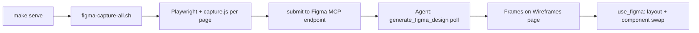

# HTML wireframes → Figma (standard workflow)

Export local HTML wireframes into a **single Figma file** using Figma’s **html-to-design** capture API, then normalize layout with **shared components** (nav, footer, logo, buttons).

Packaged for reuse on any kit project.

---

## What you need

| Requirement | Notes |
|-------------|--------|
| **Figma MCP** (Cursor) | `generate_figma_design`, `use_figma`, `get_screenshot` |
| **Node 18+** | For capture scripts |
| **Playwright** | `cd .wireframe-kit && npm ci && npx playwright install chromium` |
| **Local preview** | `make serve` — HTML must match what you want in Figma |
| **Synced shell** | `make sync` so nav/footer/logo are correct before capture |
| **Figma file** | One file per client; pages listed in `config/figma.yaml` |

Captures run **one page per process** (`figma-capture-one.mjs` + MCP poll) — do not await all pages in a single browser session.

---

## Figma file structure (recommended)

| Figma page | Purpose |
|------------|---------|
| `Wireframes` | One **frame per site page** (1440px wide), laid out in a row or grid |
| `— Foundations —` | Color / type tokens from `css/style.css` |
| `— Components —` | Primitives + site chrome (see below) |

**Components page layout**

1. **Primitives** — Button set, Card set, Section Header, **Site / Logo** (master)
2. **Site chrome** — **Site / Nav**, **Site / Footer** (instances of logo inside nav/footer)

Keep **Site / Logo** in Primitives only on the canvas; nav/footer use **instances** so the logo stays linked.

**Pitfalls**

- After `combineAsVariants`, **resize the component set** — default height can clip variants (`clipsContent`).
- Place logo **below** primitives, **above** the “Site chrome” label — not on the same Y as nav.
- Nav inner frame should be **1200px** centered in **1440** with **40px** side padding (match `--content-w` in CSS).
- Use **``** in HTML for capture; rebuild **Site / Logo** as a real component for swapping.
- Prefer **`createInstance` + `getNodeByIdAsync`** in the same file over `importComponentByKey` when swapping chrome on frames.

---

## Per-project setup (once)

### 1. Config

```bash
cp .wireframe-kit/config/figma.yaml.example .wireframe-kit/config/figma.yaml
```

Edit `file_key`, `file_url`, `wireframes_page_id` (Figma page node id for captures), viewport, spacing.

Add to `.gitignore` if the team treats Figma IDs as local-only:

```
# optional — or commit so the team shares captureIds
# .wireframe-kit/config/figma-capture-manifest.json
```

### 2. Capture manifest

Generate one `captureId` (UUID) per row in `site-map.yaml`:

```bash
make figma-init-manifest
# or merge new pages without replacing existing IDs:
make figma-init-manifest MERGE=1
```

Output: `.wireframe-kit/config/figma-capture-manifest.json`

```json
[
  { "label": "Homepage", "path": "index.html", "captureId": "…" }
]
```

**Important:** Each `captureId` is tied to a pending capture slot in Figma. Re-run `figma-init-manifest` only for new pages, or use `MERGE=1`.

### 3. Dependencies

```bash
make figma-install-deps
make figma-check
```

### 4. Preview port

Default preview is `http://localhost:8765/`. If another project uses that port:

```bash
PORT=8890 make serve
PORT=8890 make figma-capture-all
```

Scripts read `WIREFRAME_BASE` or `PORT` / `WIREFRAME_PORT`.

---

## Capture pipeline



### Step 1 — Serve HTML

```bash
make serve
make figma-check   # verifies index.html is reachable
```

Confirm in the browser: correct client, logo, nav columns, footer.

### Step 2 — Fire captures (CLI)

```bash
make figma-capture-all
# optional: skip paths already captured
SKIP_PATH=index.html make figma-capture-all
```

Each page: load → inject `capture.js` → `captureForDesign` with **12s race** (do not await unbounded).

### Step 3 — Poll (agent + Figma MCP)

For each `captureId` in the manifest:

1. `generate_figma_design` with `captureId`, `outputMode: "existingFile"`, `fileKey`, `nodeId` = wireframes page id from `figma.yaml`
2. Repeat until status is complete (or error)
3. Rename / position the resulting frame (page label, 1440×…)

Run captures **sequentially** in Figma MCP (no parallel `use_figma` writes).

### Step 4 — Layout wireframes page

- Frame width **1440**; horizontal gap **200px** (or `frame_gap_px` in config)
- Order frames to match `site-map.yaml`
- Delete duplicate empty pages if capture created extras

### Step 5 — Replace baked chrome (optional but recommended)

On each wireframe frame:

1. Remove captured top **Navigation** / bottom **Footer** groups if present
2. Place **Site / Nav** instance at top (1440×60)
3. Place **Site / Footer** instance at bottom (1440×height)
4. Middle content stays from html-to-design capture

Build **Site / Nav** and **Site / Footer** once on `— Components —`, then instance everywhere.

### Step 6 — Design system pass

- **Foundations:** swatches from CSS custom properties
- **Components:** extract buttons/cards from CSS; fix variant set bounds after `combineAsVariants`
- Link header/footer logo to **Site / Logo** master

---

## Agent skill

Load **`/wireframe-to-figma`** for the full checklist (config → manifest → capture → poll → layout → components).

Canonical procedures also live in [AI-INSTRUCTIONS.md](./AI-INSTRUCTIONS.md) under **Task: Export to Figma**.

---

## Makefile targets

| Target | Action |
|--------|--------|
| `make figma-install-deps` | `npm ci` in `.wireframe-kit` + Chromium for Playwright |
| `make figma-check` | Node, Playwright, preview URL, manifest exists |
| `make figma-init-manifest` | Build/update `figma-capture-manifest.json` from `site-map.yaml` |
| `make figma-capture-all` | Submit all pages (one process each) |
| `make figma-capture-one CAPTURE_ID=… PATH=index.html` | Single page |
| `make figma-list-captures` | Print captureIds for MCP poll |

---

## HTML prerequisites for clean capture

1. **`make sync`** — shared nav/footer across all pages in `site-map.yaml`
2. **Logo** — use project `assets/logo.svg` (or PNG) in nav/footer, not text-only placeholders
3. **Viewport** — wireframe CSS assumes ~1440 content width; capture at 1440×900
4. **No dev-only overlays** — hide debug banners before capture
5. **Stable URLs** — paths in manifest must match repo-root HTML paths

---

## Troubleshooting

| Symptom | Fix |
|---------|-----|
| Wrong site in capture | Wrong `PORT` / another server on 8765 — set `PORT` and `WIREFRAME_BASE` |
| Playwright hangs | Use `make figma-capture-all` (one process per page), not a single long-running batch |
| Capture never completes | Poll with `generate_figma_design`; re-fire single page if stale |
| Buttons clipped in Figma | Resize component set; set `clipsContent: false` |
| Logo overlaps nav on Components page | Logo in Primitives; Site chrome section below |
| `importComponentByKey` fails | Same-file `getNodeByIdAsync` + `createInstance` |
| Footer copy wrong | Project `sync-footer.py` + `make sync`, then re-capture |

---

## Files in the kit

| File | Role |
|------|------|
| [figma-html-export.md](./figma-html-export.md) | This guide |
| [config/figma.yaml.example](./config/figma.yaml.example) | Figma file + page targets |
| [config/figma-capture-manifest.example.json](./config/figma-capture-manifest.example.json) | Manifest shape |
| [scripts/figma-env.mjs](./scripts/figma-env.mjs) | Shared preview base URL |
| [scripts/figma-init-manifest.mjs](./scripts/figma-init-manifest.mjs) | Manifest from site-map |
| [scripts/figma-capture-one.mjs](./scripts/figma-capture-one.mjs) | Single-page capture (preferred) |
| [scripts/figma-capture-all.sh](./scripts/figma-capture-all.sh) | Loop manifest |
| [scripts/figma-poll-captures.mjs](./scripts/figma-poll-captures.mjs) | List captureIds |
| [scripts/figma-check-deps.sh](./scripts/figma-check-deps.sh) | Preflight |
| [skills/wireframe-to-figma/SKILL.md](./skills/wireframe-to-figma/SKILL.md) | Agent skill |

Project-specific: `config/figma.yaml`, `config/figma-capture-manifest.json` (generated).
